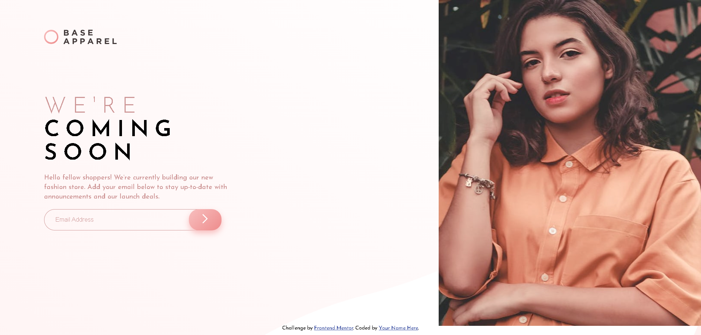
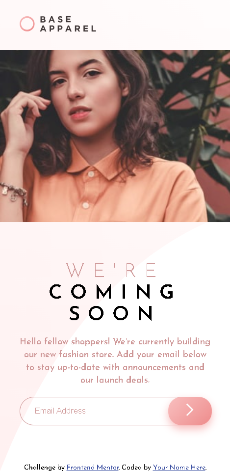

# Frontend Mentor - Base Apparel coming soon page solution

This is a solution to the [Base Apparel coming soon page challenge on Frontend Mentor](https://www.frontendmentor.io/challenges/base-apparel-coming-soon-page-5d46b47f8db8a7063f9331a0). Frontend Mentor challenges help you improve your coding skills by building realistic projects. 

## Table of contents

- [Overview](#overview)
  - [The challenge](#the-challenge)
  - [Screenshot](#screenshot)
  - [Links](#links)
- [My process](#my-process)
  - [Built with](#built-with)
  - [What I learned](#what-i-learned)
  - [Continued development](#continued-development)
  - [Useful resources](#useful-resources)
- [Author](#author)
- [Acknowledgments](#acknowledgments)

## Overview

This is a **"Coming Soon"** landing page for a fashion store, designed to notify users about the upcoming launch. The landing page collects email addresses and provides validation for proper email format. The page is responsive and works well across mobile, tablet, and desktop devices.

### The challenge

  To create a responsive landing page with:

- Proper email validation functionality.
- Receive an error message when the `form` is submitted if:
  - The `input` field is empty
  - The email address is not formatted correctly
- See hover states for all interactive elements on the page
- A design that adapts across different screen sizes.
- Modern layout using CSS Flexbox and media queries.

### Screenshot

- **Base Apparel coming soon page solution - Desktop Design**


- **Base Apparel coming soon page solution - Mobile Design**


### Links

- Solution URL: [https://github.com/hoor23/base-apparel-coming-soon-master.git](https://github.com/hoor23/base-apparel-coming-soon-master.git)
- Live Site URL: [https://hoor23.github.io/base-apparel-coming-soon-master/](https://hoor23.github.io/base-apparel-coming-soon-master/)

## My process

### Built with

- Semantic HTML5 markup
- CSS3 for layout and responsiveness
- JavaScript for form validation
- Flexbox for layout management
- Mobile-first workflow
- Google Fonts for typography: [Josefin Sans](https://fonts.google.com/specimen/Josefin+Sans)

### What I learned

During the development of this landing page, I focused on implementing:

Email validation using regular expressions in JavaScript to ensure proper user input.
Responsive design techniques, adjusting elements for different screen sizes using media queries and flexbox.
Here's a code snippet of the JavaScript email validation logic:

```js
function validate(inputText) {
    const mailformat = /^\w+([\.-]?\w+)*@\w+([\.-]?\w+)*(\.\w{2,3})+$/;
    if (inputText.value.match(mailformat)) {
        // Valid email
        validateEmail = true;
        subscriptionForm.classList.remove("invalid-email");
    } else {
        // Invalid email
        verificationMessage.style.display = 'block';
        validateEmail = false;
        icon_error.classList.add("error");
        subscriptionForm.classList.add("invalid-email");
    }
}
```

### Continued development

In future projects, I plan to:

- Improve accessibility by ensuring the landing page is fully compliant with WCAG guidelines.
- Explore CSS Grid for layout management alongside Flexbox.
- Integrate more complex animations and transitions for a more interactive user experience.

### Useful resources

- [MDN Web Docs](https://developer.mozilla.org/en-US/docs/Learn/Forms/Form_validation) - Form Validation - This helped me understand how to handle form validation using JavaScript.
- [CSS Tricks- Flexbox Guide](https://css-tricks.com/snippets/css/a-guide-to-flexbox/) - A great reference for working with Flexbox for responsive layouts.
- [Google Fonts](https://fonts.google.com/specimen/Josefin+Sans) - Used for importing the Josefin Sans font.

## Author

- Github - [hoor23](https://github.com/hoor23)
- Frontend Mentor - [hoor23](https://www.frontendmentor.io/profile/hoor23)
- Linkedin - [Hoor Seyda](linkedin.com/in/hoor-seyda-901176222)

## Acknowledgments

Thanks to Frontend Mentor for providing this challenge and for creating a great platform for improving my frontend development skills. Special thanks to the online community for their support and feedback.